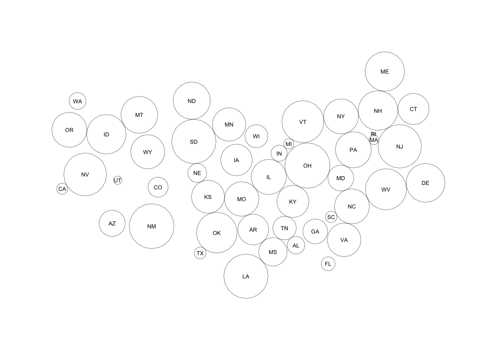
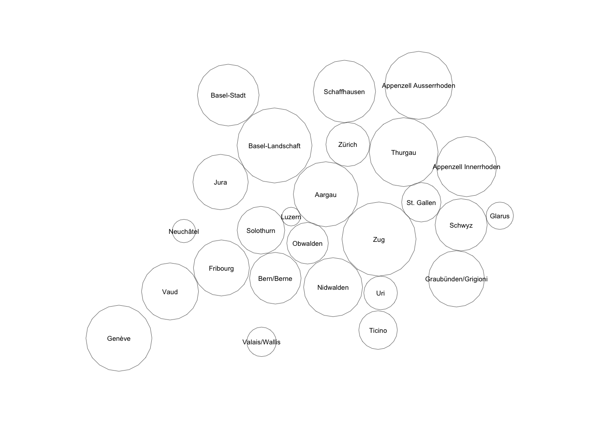

# spdorling

Create Dorling Cartograms from Contiguous Region Shapefiles

## Description

Create Dorling Cartograms from Contiguous Region Shapefiles

## What’s Inside The Tin

  - `dorling_from_sp`: Compute center coordinates, circle radii and
    Dorling polygons from input polygons and values

The following functions are implemented:

## Installation

``` r
devtools::install_github("hrbrmstr/spdorling")
```

## Usage

``` r
library(spdorling)

# current verison
packageVersion("spdorling")
```

    ## [1] '0.1.0'

### Lower 48 U.S.A.

``` r
library(albersusa) # hrbrmstr/albersusa
library(hrbrthemes)
library(tidyverse)

usa <- albersusa::usa_composite(proj = "laea")
usa <- subset(usa, !(name %in% c("Alaska", "Hawaii", "District of Columbia")))

set.seed(2018)
usa$val <- sample(10000, 48)

dor <- dorling_from_sp(usa, value=usa$val, quiet=FALSE)
```

    ## Scale factor of 1 => number of overlaps : 12 
    ## Scale factor of 0.9795918 => number of overlaps : 15 
    ## Scale factor of 0.9591837 => number of overlaps : 7 
    ## Scale factor of 0.9387755 => number of overlaps : 9 
    ## Scale factor of 0.9183673 => number of overlaps : 8 
    ## Scale factor of 0.8979592 => number of overlaps : 6 
    ## Scale factor of 0.877551 => number of overlaps : 0

``` r
discs_df <- fortify(dor$discs)

as_data_frame(dor$xy) %>% 
  set_names(c("lng", "lat")) %>% 
  mutate(iso2c = usa$iso_3166_2) -> usa_labs

ggplot() +
  geom_polygon(
    data = discs_df, aes(long, lat, group=group), 
    size=0.125, color="#2b2b2b", fill="#00000000"
  ) +
  geom_text(data = usa_labs, aes(lng, lat, label=iso2c), size=2) +
  coord_fixed() +
  labs(x=NULL, y=NULL) +
  theme_ipsum_rc(grid="") +
  theme(axis.text=element_blank())
```



### Swiss Cantons

``` r
library(sp)
library(rgdal)
```

    ## rgdal: version: 1.2-18, (SVN revision 718)
    ##  Geospatial Data Abstraction Library extensions to R successfully loaded
    ##  Loaded GDAL runtime: GDAL 2.1.3, released 2017/20/01
    ##  Path to GDAL shared files: /Library/Frameworks/R.framework/Versions/3.5/Resources/library/rgdal/gdal
    ##  GDAL binary built with GEOS: FALSE 
    ##  Loaded PROJ.4 runtime: Rel. 4.9.3, 15 August 2016, [PJ_VERSION: 493]
    ##  Path to PROJ.4 shared files: /Library/Frameworks/R.framework/Versions/3.5/Resources/library/rgdal/proj
    ##  Linking to sp version: 1.2-7

``` r
readOGR(
  system.file("extdat", "swiss-cantons.json", package="spdorling"),
  verbose = FALSE,
  stringsAsFactors = FALSE
) -> cantons

# convert it to equal area
SpatialPolygonsDataFrame(
  spTransform(cantons, CRS("+proj=aea +lat_1=45.96 +lat_2=47.50 +lon_0=8.34")),
  data = cantons@data
) -> cantons

set.seed(2018)
cantons$val <- sample(10000, nrow(cantons@data))

dor <- dorling_from_sp(cantons, value=cantons$val, quiet=FALSE)
```

    ## Scale factor of 1 => number of overlaps : 17 
    ## Scale factor of 0.9795918 => number of overlaps : 5 
    ## Scale factor of 0.9591837 => number of overlaps : 9 
    ## Scale factor of 0.9387755 => number of overlaps : 7 
    ## Scale factor of 0.9183673 => number of overlaps : 15 
    ## Scale factor of 0.8979592 => number of overlaps : 7 
    ## Scale factor of 0.877551 => number of overlaps : 8 
    ## Scale factor of 0.8571429 => number of overlaps : 0

``` r
discs_df <- fortify(dor$discs)

as_data_frame(dor$xy) %>% 
  set_names(c("lng", "lat")) %>% 
  mutate(name = cantons$name) -> cantons_labs

ggplot() +
  geom_polygon(
    data = discs_df, aes(long, lat, group=group), 
    size=0.125, color="#2b2b2b", fill="#00000000"
  ) +
  geom_text(data = cantons_labs, aes(lng, lat, label=name), size=2) +
  coord_fixed() +
  labs(x=NULL, y=NULL) +
  theme_ipsum_rc(grid="") +
  theme(axis.text=element_blank())
```


